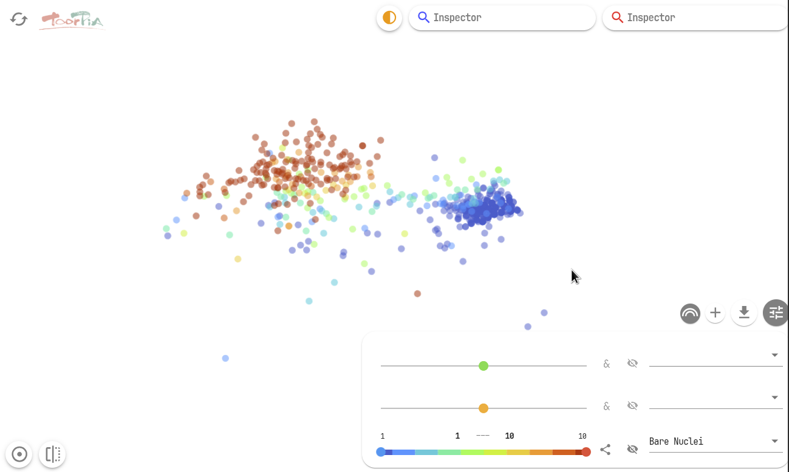

# Map Inspector User Guide

Map Inspector is an interactive tool for deep-dive analysis of plot feature attributes in maps generated by toorPIA. It operates in a web browser and allows intuitive analysis operations including:

## Key Features

- Display feature statistics (mean values, standard scores) for selected areas (including pinpoint selection)
- Comparison (difference) display between two selected areas
- Color coding of plots based on variable ranges on the map
- Variable range specification with AND/OR conditions for up to 6 variables
- Heatmap display for data density visualization
- Sub-map generation and data cleansing (not available in toorPIA API currently)

---

## Basic Operations

### Launching Map Inspector

Map Inspector can be automatically accessed through the `shareUrl` property of the toorPIA API:

```python
from toorpia import toorPIA
import pandas as pd

# Create API client
client = toorPIA()

# Create base map
df = pd.read_csv("data.csv")
result = client.fit_transform(df)

# Open Map Inspector in browser
print(f"Map Inspector URL: {client.shareUrl}")
```

### Map Navigation and Zoom

- **Map Movement**: Drag the map to change position
- **Zoom In/Out**: Use mouse wheel for zoom operations
- **Reset**: Click the reset icon in the top-left corner of the map to return to initial display


**Note**: Mouse wheel zoom operations can be easily confused with browser page scrolling, so be careful of unintentional zooming.

---

## Plot Color Coding by Attributes

### Attribute Selection Panel

Click the "Attribute Selector Menu" in the bottom-right corner of the map to open the attribute selection panel.


#### Basic Color Coding Steps

1. **Select Attribute**: Choose the target attribute from the dropdown menu in the selector
2. **Specify Value**: Specify values or ranges using the left-side selector
3. **Automatic Coloring**: Plots matching the specified conditions are colored

#### Search Function

When there are many items, click on the item name display area and type part of the item name to filter the choices.

#### Multiple Conditions

- **AND Conditions**: Click the "&" icon in the center of each selector
- **OR Conditions**: Default behavior (specify different conditions with multiple selectors)

#### Visibility Adjustment

- **Visibility Button**: Temporarily hide specific colors using the button next to the selector
- **Blinking Display**: Click the Visibility button twice to make coloring blink, making positions easier to identify

### Rainbow Gradient Annotation

A feature to visualize value distribution with gradients for numerical attributes.

1. Click the **rainbow icon** in the top-right corner of the attribute selection panel
2. Select the target attribute to display warm-to-cool color gradients based on value magnitude
3. Adjust value range using sliders
4. Use the line connection icon to connect plots in attribute value order (effective for time-series data)



---

## Area Analysis Functions

### Ellipse Area Selection

Select "Area Inspector" at the top of the screen to enter ellipse drawing mode on the map.


#### Area Analysis Steps

1. **Draw Ellipse**: Draw an ellipse that encompasses the area of interest
2. **Statistics Display**: Display attribute value averages and standard scores for plots within the ellipse
3. **Feature Understanding**: Display attributes in order of absolute standard score magnitude (up to 10 attributes)

#### Standard Score Interpretation

- **Positive Score**: Positive contribution to area formation (attraction due to similarity)
- **Negative Score**: Negative contribution to area formation (negative pressure from surroundings)

#### T-Score (Deviation Score) Display

Right-click on the score display panel and select "Show T-Score instead of z-Score" to switch to deviation score display.

### Area Comparison Function

When two areas are specified, click the **comparison icon** on the left side of the "Area Inspector" to display the area comparison panel.

- Display standard score differences between blue and red areas, sorted by absolute difference magnitude
- Identify feature attributes that contribute to the separation between two areas

### Plot Inspector

To check detailed information for individual plots:

1. Click the icon at the right end of the "Area Inspector" to change to "Plot Inspector" mode
2. Click on the target plot to display detailed attribute information

#### Detailed Information

Right-click on a plot to display the following menu:

- **Show a list of All the Plots**: Display list of selected plots
- **Show Plot Info**: Display detailed information dialog

---

## Heatmap Functionality

Since scatter plots cannot properly represent plot overlap, heatmaps are effective for confirming data density.

### Heatmap Display

Click the **heatmap button** in the bottom-left corner of the screen to switch to heatmap display.


### Display Options

#### Plot Display Control

- **Hide Plots**: Disable plot display using the second button from the left
- **Hide Selector**: Close the panel using the button in the top-right corner of the attribute selector

#### Target Plot Specification

Specify targets using selection buttons in the heatmap control panel:

- **All Plots**: Target all plots (default)
- **Use Colored Plots Only**: Only colored plots
- **Use Plots in Area Only**: Only plots within ellipse areas

#### Display Adjustment

- **Effective Radius**: Adjust plot influence range (large→smooth, small→detailed)
- **Z Axis Max**: Adjust Z-axis maximum value (for detailed examination of low-density areas)

---

## State Save and Restore

### Save Current State

Analysis states (coloring, area selection, etc.) can be saved to continue work across sessions.

1. **Right-click** on the map
2. Select "Save the Current Status"
3. State is saved to the `status.mi` file

### Multiple Map Inspector State Sharing

To avoid state file conflicts when launching multiple Map Inspectors simultaneously, specify different state files for each.
(W.I.P. feature)

---

## Sub-Map Generation (Not Available in toorPIA API Currently)

Map Inspector can extract plots that meet specific conditions or are contained within specific areas to generate new maps (sub-maps).

### Sub-Map Generation by Area Selection

1. **Ellipse Area Selection**: Draw an ellipse encompassing target plots
2. **Sub-Map Generation**: Right-click within the ellipse area → "Generate a new Map containing only the Plots in the Area"
3. **Specify File Names**: Sequentially specify names for segment file, XY file, and state file
4. **Display Sub-Map**: Click "OPEN" in the final dialog

### Sub-Map Generation by Attribute Conditions

1. **Plot Coloring**: Color target plots using the attribute selection panel
2. **Sub-Map Generation**: Right-click on the attribute selection panel → "Generate a new Map containing only the Colored Plots"
3. For multiple colors, all colored plots are included

### Map Navigation

- **Return to Original Map**: Right-click → "Move back to the Previous Map"
- **Move to Sub-Map**: Select the same menu in the original map

---

## Data Cleansing (Not Available in toorPIA API Currently)

Using Map Inspector's sub-map functionality, you can generate CSV files with measurement errors removed.

### Cleansing Steps

1. **Identify Abnormal Plots**: Use heatmaps or scatter plots to identify normal data cluster areas
2. **Select Normal Area**: Specify normal data area using ellipse
3. **Generate CSV File**: Right-click within the selected area → "Create a raw CSV File subset containing only the Plots in the Area"
4. **Specify File Name**: Specify save location for cleansed CSV file

### Result Verification

Verify the generated CSV file row count:

```bash
wc -l cleansed_data.csv
# Original 1000 rows → Post-cleansing 986 rows (+1 header row)
```


## Troubleshooting

### Common Issues and Solutions

#### Map Inspector Launch is Slow
**Cause**: Too much data (over 10,000 rows)  
**Solution**: Reduce data and try again

### Performance Optimization

- **Data Preprocessing**: Remove unnecessary columns beforehand
- **Plot Count Limitation**: Use sub-maps for step-by-step analysis of large data
- **Browser Cache**: Avoid re-reading identical data

---

## Next Steps

For advanced analysis techniques using Map Inspector, also refer to the following documents:

- [API Reference](api-reference.md) - Detailed parameter settings
- [Troubleshooting](troubleshooting.md) - Detailed problem-solving guide